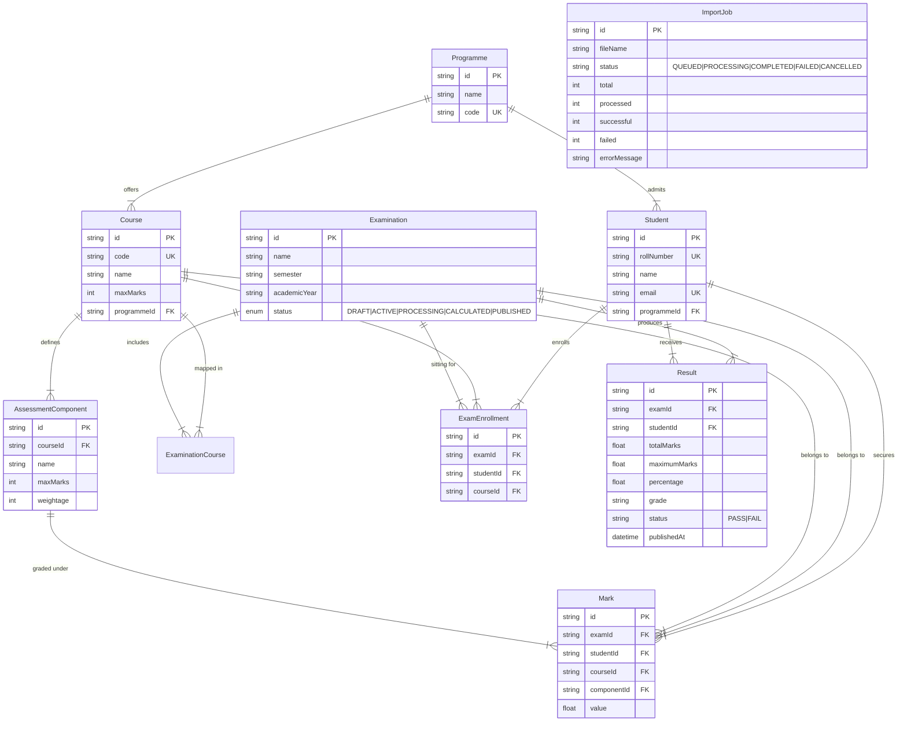

# University Examination & Result Processing System

A production-oriented backend application built with **Node.js**, **Express**, **TypeScript**, **PostgreSQL**, **Prisma ORM**, and **React**. The system supports multi-programme academic hierarchy setup, student enrollments, component mark validations, result calculation, publishing state gates, and asynchronous PostgreSQL-backed bulk CSV mark ingestion (`pg-boss`) designed for high scale (1,000,000+ students, 100,000+ marks per examination).

---

## Table of Contents
1. [Architecture](#architecture)
2. [Database Design & ER Diagram](#database-design--er-diagram)
3. [Queue Design & Asynchronous Processing](#queue-design--asynchronous-processing)
4. [Transaction Strategy](#transaction-strategy)
5. [Idempotency Strategy](#idempotency-strategy)
6. [Concurrency Strategy](#concurrency-strategy)
7. [Failure & Retry Strategy](#failureretry-strategy)
8. [Scaling Considerations (1M+ Students / 100k+ Marks)](#scaling-considerations-1m-students--100k-marks)
9. [Technology Choices](#technology-choices)
10. [Trade-offs](#trade-offs)
11. [API Endpoints](#api-endpoints)
12. [Migrations & Run Instructions](#migrations--run-instructions)
13. [Testing & Verification](#testing--verification)

---

## Architecture

The system uses a clean **Layered Decoupled Architecture** (`Routes` → `Controllers` → `Services` → `Repositories` → `Domain/Database`):

```text
[ React Web Application / Postman ]
                 │
                 │ HTTP / REST APIs
                 ▼
[ Express.js API Server (TypeScript) ]
  ├── Routes & Middlewares (Multer file upload)
  ├── Controllers & Domain Services (Validation rules)
  └── Repositories & Prisma ORM
                 │
  ┌──────────────┴──────────────────────────┐
  │                                         │
  ▼                                         ▼
[ PostgreSQL Database ]            [ Local Disk / Storage ]
  ├── Academic Data Tables                  │ (Uploaded CSV Files)
  └── pgboss Queue Schema                   │
         ▲                                  │
         │ Read / Write Marks               │ Read Stream
         │                                  │
[ pg-boss Background Worker Queue ] ────────┘
  └── Streams CSV -> Line Validation -> Bulk Ingestion
```

---

## Database Design & ER Diagram

### Entity-Relationship Diagram



### Relational Schema Design
- **`Programme`**: Top-level academic program (e.g. B.Tech Computer Science).
- **`Course`**: Academic subject with `maxMarks` (e.g. Data Structures).
- **`AssessmentComponent`**: Breakdown per course (e.g. Midterm 30%, Final 70%). Composite unique constraint on `(courseId, name)`.
- **`Examination`**: Examination session state machine (`DRAFT` → `ACTIVE` → `CALCULATED` → `PUBLISHED`).
- **`ExamEnrollment`**: Explicit mapping ensuring students can only receive marks for courses they are enrolled in. Composite unique constraint on `(examId, studentId, courseId)`.
- **`Mark`**: Student component marks. Composite unique constraint on `(examId, studentId, courseId, componentId)`.
- **`Result`**: Consolidated student exam performance (Total Marks, Percentage, Grade `A`-`F`, Pass/Fail). Composite unique constraint on `(examId, studentId)`.
- **`ImportJob`**: Tracks asynchronous CSV bulk ingestion metrics (`total`, `processed`, `successful`, `failed`, `status`).

---

## Queue Design & Asynchronous Processing

### The Problem
Processing **100,000+ mark rows** synchronously over a standard HTTP request takes 1 to 2 minutes, causing connection timeouts (30-60s limit) and freezing the single-threaded Node.js API event loop for all other concurrent users.

### The Solution (`pg-boss` + Streaming Engine)
1. **Zero Redis Overhead**: Uses `pg-boss` for durable PostgreSQL-backed background job queueing utilizing `FOR UPDATE SKIP LOCKED` for task locking.
2. **Immediate HTTP Response**: `POST /api/marks/import` saves the file to disk, creates an `ImportJob` record (`status: "QUEUED"`), enqueues the job to `pg-boss`, and returns `{ jobId }` in **< 50ms**.
3. **O(1) Streaming Parser**: The background worker reads the uploaded file line-by-line using `node:fs` streams piped into `csv-parse`. This keeps Node.js RAM consumption flat (< 30 MB) regardless of whether the CSV file contains 1,000 rows or 1,000,000 rows.
4. **Batch Metrics Update**: Every 500 rows, the worker updates the progress counters (`total`, `processed`, `successful`, `failed`) in the `ImportJob` database table.
5. **Real-time UI Polling**: The React client polls `GET /api/marks/import/:jobId` every 1 second to update the progress bar.

---

## Transaction Strategy

1. **Atomic Result Calculation**: When calculating results for an examination (`resultService.calculateResults`), calculations across enrollments, component marks, percentage computation, and grade generation execute atomically.
2. **Cascading Relational Integrity**: All relational associations enforce strict PostgreSQL foreign key constraints to prevent orphaned records.
3. **Transactional Status Gates**: Examination status transitions (`DRAFT` → `CALCULATED` → `PUBLISHED`) are guarded inside database transactions to ensure results cannot be published before calculation.

---

## Idempotency Strategy

1. **Composite Unique Key Constraints**:
   - `Mark`: `@@unique([examId, studentId, courseId, componentId])`
   - `ExamEnrollment`: `@@unique([examId, studentId, courseId])`
   - `Result`: `@@unique([examId, studentId])`
2. **Duplicate Upload Protection**: If the same CSV file or duplicate mark rows are submitted multiple times, the unique key constraints prevent duplicate mark insertion.
3. **Upsert Semantics**: Result calculation uses `upsert` operations on `(examId, studentId)`, making recalculations safe and idempotent.

---

## Concurrency Strategy

1. **PostgreSQL SKIP LOCKED Job Allocation**: `pg-boss` uses `SELECT ... FOR UPDATE SKIP LOCKED` when assigning background jobs to workers. Multiple API worker processes can run concurrently without double-processing jobs or race conditions.
2. **Database Query Indexing**:
   - `Mark` table indexed on `(examId)`, `(studentId)`, `(courseId)`, and `(componentId)`.
   - `Result` table indexed on `(examId)` and `(studentId)`.
   - `ExamEnrollment` indexed on `(examId, studentId, courseId)`.
3. **Non-Blocking I/O**: Asynchronous worker execution allows the main Express API server to handle high concurrent HTTP request traffic uninterrupted.

---

## Failure & Retry Strategy

1. **Fault-Tolerant Row Level Ingestion**:
   - If a 100,000-row CSV contains 2 invalid rows (e.g. `value > maxMarks` or student not enrolled), the worker logs the error for those specific rows, increments the `failed` counter, and **continues processing the remaining 99,998 valid rows**.
2. **Worker Panic & Auto-Retry**:
   - Jobs configured with `retryLimit: 3` and `retryDelay: 5s` in `pg-boss`. If a worker process crashes mid-file, `pg-boss` automatically re-queues the job.
3. **Graceful Job Cancellation**:
   - Users can trigger `POST /api/marks/import/:jobId/cancel`. The worker stream detects the cancellation state every 100 rows, halts execution, logs status as `CANCELLED`, and deletes the temporary file.
4. **Disk Cleanup Guarantee**:
   - Temporary uploaded files are unlinked (`fs.unlink`) upon job completion, failure, or cancellation to prevent disk bloat.

---

## Scaling Considerations (1M+ Students / 100k+ Marks)

1. **Memory Efficiency**: Streaming CSV parsing prevents loading massive arrays into RAM. Memory remains constant ($O(1)$) even for 1,000,000 rows.
2. **Horizontal Worker Scaling**: `pg-boss` workers can be decoupled from the API web server into independent worker instances scaling horizontally across multiple container replicas.
3. **Database Read Replicas**: High-volume student result query traffic (`GET /api/examinations/:examId/results`) can be routed to PostgreSQL read-replicas.
4. **Database Table Partitioning**: For multi-million student scale across multiple academic years, the `Mark` and `Result` tables can be range/hash partitioned by `examId` or `academicYear`.

---

## Technology Choices

| Layer | Technology | Justification |
| :--- | :--- | :--- |
| **Language** | TypeScript / Node.js | Strict type safety, high I/O throughput, non-blocking asynchronous event loop. |
| **API Framework** | Express.js | Industrial standard lightweight web server framework. |
| **Database** | PostgreSQL | ACID compliance, strong relational constraints, JSON/indexing support. |
| **ORM** | Prisma ORM | Type-safe query building, migration management, schema auto-generation. |
| **Job Queue** | `pg-boss` | PostgreSQL-native durable queue; eliminates extra Redis infrastructure overhead. |
| **Parser** | `csv-parse` | Node stream parser for memory-efficient line-by-line CSV processing. |
| **Frontend UI** | React + Vite + Tailwind | Responsive dashboard for operational testing and demonstration. |
| **Containerization**| Docker Compose | Single-command container deployment for database and API server. |

---

## Trade-offs

1. **`pg-boss` (PostgreSQL) vs. Redis (BullMQ)**:
   - *Trade-off*: Redis offers slightly higher raw queue throughput (sub-millisecond), but introduces an extra container dependency and memory volatile storage.
   - *Decision*: `pg-boss` provides durable, transactional PostgreSQL storage with `SKIP LOCKED`, avoiding Redis infrastructure complexity.
2. **Co-located Worker vs. Isolated Microservice**:
   - *Trade-off*: Running the worker inside the API process simplifies development and docker compose deployment, but shares process memory with HTTP routes.
   - *Decision*: Co-located worker for single-command run simplicity, but structured statelessly so it can be deployed independently in production.
3. **Local Temporary Upload Storage vs. Cloud S3**:
   - *Trade-off*: Saving uploaded CSVs to `uploads/` disk is fast locally, but requires shared storage if running multiple API instances.
   - *Decision*: Local disk storage for local evaluation; easily swappable with AWS S3 / MinIO via Multer S3 storage.

---

## API Endpoints

### Academic Setup & Enrollments
- `POST /api/programmes` - Create academic programme
- `POST /api/students` - Register student
- `POST /api/courses` - Create course
- `POST /api/examinations` - Create examination sitting
- `POST /api/courses/:courseId/components` - Add assessment component (maxMarks, weightage)
- `POST /api/examinations/:examId/courses` - Map course to examination
- `POST /api/examinations/:examId/enrollments` - Enroll student in course for examination

### Marks & Bulk Queue Ingestion
- `POST /api/marks` - Single mark entry & validation
- `POST /api/marks/import` - Upload CSV file and queue background worker job
- `GET /api/marks/import/:jobId` - Poll background job ingestion status & metrics
- `POST /api/marks/import/:jobId/cancel` - Cancel active queued/processing import job

### Results Processing & Publishing
- `POST /api/examinations/:examId/results/calculate` - Aggregate marks, compute percentage/grades (A-F), update state to `CALCULATED`
- `POST /api/examinations/:examId/results/publish` - Set timestamp and publish results (State `PUBLISHED`)
- `GET /api/examinations/:examId/results` - Fetch student examination results

---

## Migrations & Run Instructions

### Option 1: Docker Compose (Single Command Setup ⭐)

```bash
cd api
docker compose up --build
```
- Starts PostgreSQL 16 container on port `5432`.
- Runs Prisma migrations (`npx prisma db push`).
- Starts the Express API server on port `4000`.

---

### Option 2: Local Development Setup

#### 1. Backend API (`api/`)
```bash
cd api
npm install
npm run db:migrate
npm run dev
```
API runs on `http://localhost:4000`.

#### 2. Web Application (`web/`)
```bash
cd web
npm install
npm run dev
```
Web Dashboard runs on `http://localhost:5173`.

---

## Testing & Verification

### Generate Test Datasets & CSV Files
Run the built-in generator scripts inside `api/`:

```bash
cd api

# 1. Generate 4 feature-specific test CSVs (Valid, Over-marks, Unenrolled, Mixed)
npm run seed:test-csvs

# 2. Generate 10,000 valid scale test CSV file
npm run seed:10k

# 3. Generate 100,000 valid scale test CSV file
npm run seed:100k
```

### Visual Database Inspection
Open Prisma Studio to inspect all database tables visually:
```bash
cd api
npm run db:studio
```
Access at `http://localhost:5555`.
